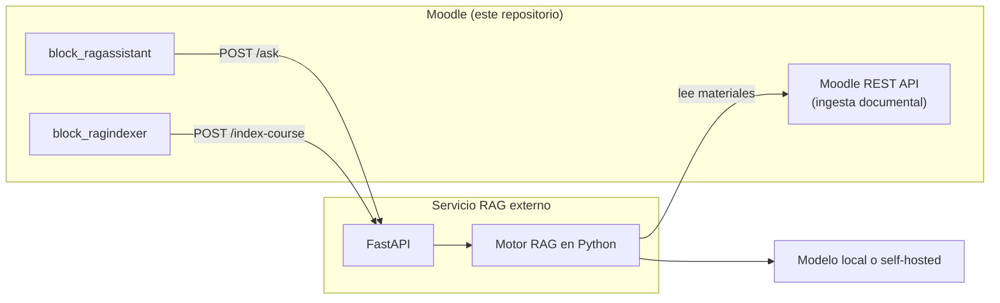

# LoyolaTeams-IA

Entorno Moodle dockerizado de LoyolaTeams con dos bloques propios que integran un asistente documental (RAG) servido por un backend externo.

El repositorio contiene el LMS, las herramientas Docker de desarrollo y los dos bloques PHP. **No contiene el motor RAG**: los bloques son interfaz de usuario y transporte HTTP hacia un servicio externo que debe desplegarse por separado.

## Qué incluye el repositorio

- `moodle/` — Código de Moodle 5.0.x (`$release = '5.0.7'`, branch `500`).
- `moodle-docker/` — Herramientas oficiales [moodlehq/moodle-docker](https://github.com/moodlehq/moodle-docker) para levantar el entorno local.
- `moodle/blocks/ragassistant/` — Bloque `block_ragassistant`: chat de consulta al asistente.
- `moodle/blocks/ragindexer/` — Bloque `block_ragindexer`: lanzamiento de la indexación de un curso.

## Puesta en marcha de Moodle con Docker

El entorno usa `moodle-docker` (documentación completa en `moodle-docker/README.md`).

```bash
# Variables de entorno, en cada terminal nueva
export MOODLE_DOCKER_WWWROOT=/ruta/al/repositorio/moodle
export MOODLE_DOCKER_DB=mariadb
cd moodle-docker

# Crear y arrancar los contenedores
bin/moodle-docker-compose up -d

# Parar y reanudar conservando los datos
bin/moodle-docker-compose stop
bin/moodle-docker-compose start

# Ver el estado de los contenedores
bin/moodle-docker-compose ps

# Purgar cachés tras cambiar código PHP/JS de los bloques
bin/moodle-docker-compose exec webserver php admin/cli/purge_caches.php

# Destruir el entorno (elimina los datos)
bin/moodle-docker-compose down
```

- Moodle queda accesible en `http://localhost:8000/`. El puerto se controla con `MOODLE_DOCKER_WEB_PORT` (valor por defecto `127.0.0.1:8000`, definido en `moodle-docker/README.md` y aplicado en `webserver.port.yml`).
- `moodle-docker/local.yml` añade `host.docker.internal:host-gateway` al contenedor `webserver`, de modo que los bloques pueden alcanzar servicios que se ejecutan en la máquina anfitriona.

Para instalar los bloques basta con que estén en `moodle/blocks/`; Moodle los detecta al entrar como administrador y ejecutar la actualización de la instalación.

## Bloques añadidos

| Bloque | Carpeta | Función Moodle expuesta | Endpoint externo que consume |
|---|---|---|---|
| `block_ragassistant` | `moodle/blocks/ragassistant` | `block_ragassistant_ask` (read, AJAX) | `POST {apiurl}/ask` |
| `block_ragindexer` | `moodle/blocks/ragindexer` | `block_ragindexer_index_course` (write, AJAX) | `POST {apiurl}/index-course` |

Ambos declaran `version 1.0.0`, madurez `MATURITY_ALPHA` y requieren Moodle 4.0 o superior (`requires 2022041900`).

### `block_ragassistant`

Bloque de chat visible en la vista de curso y en las páginas de actividad (`applicable_formats`: `course-view`, `mod`). Su responsabilidad:

- Recoge la pregunta del usuario en la interfaz del bloque y la envía por AJAX a la función externa `block_ragassistant_ask` (`amd/src/chat.js`).
- Valida contexto y capacidad `block/ragassistant:ask` antes de continuar (`classes/external/ask.php`).
- Obtiene desde Moodle el contexto disponible de la consulta (`classes/service/context_builder.php`): `course_id`, `role` derivado de las capacidades del usuario en el curso, `section_id`, `activity_id`, `resource_id`, `language` normalizado y `visibility`.
- Envía la consulta al servicio RAG externo mediante `POST {apiurl}/ask` (`classes/service/rag_client.php`) y normaliza cualquier fallo de red o HTTP a un estado del contrato.
- Recibe la respuesta, las fuentes citadas y las advertencias, y las presenta dentro de Moodle. Las fuentes se recortan a `chunk_id`, `source_uri`, `document_title`, `section` y `page`; no se muestra el texto completo de los fragmentos.
- Registra en la tabla local `block_ragassistant_log` un log mínimo: `courseid`, `userid`, `contextid`, `cmid`, hash SHA-256 de la pregunta, estado, número de fuentes, puntuación y latencia.

El bloque no realiza embeddings, recuperación vectorial, BM25, re-ranking, generación con LLM ni evaluación: todo eso ocurre en el servicio externo.

### `block_ragindexer`

Bloque visible solo en la vista de curso y solo para quien tenga la capacidad `block/ragindexer:indexcourse` (por defecto, profesorado editor y gestores). Su responsabilidad:

- Ofrece un botón para lanzar la actualización del índice del curso y una casilla de reindexación forzada, que exige además la capacidad `block/ragindexer:forcereindex` (por defecto, solo gestores).
- Envía al servicio externo la identificación del curso mediante `POST {apiurl}/index-course` (`classes/service/rag_client.php`). El `course_id` que se transmite es el `courseid` ya validado contra el contexto y las capacidades de Moodle.
- Muestra el resultado agregado que devuelve el servicio: documentos nuevos, sin cambios, modificados y eliminados; chunks añadidos y obsoletos; embeddings recalculados; actualizaciones de visibilidad; e incidencias resumidas (máximo 10 mensajes, 200 caracteres cada uno).

El bloque no realiza parsing, chunking, embeddings, almacenamiento vectorial, recuperación ni generación: solo solicita la operación y presenta su resultado.

## Arquitectura de integración con un RAG externo

Los bloques necesitan un servicio RAG externo accesible por HTTP. El reparto de responsabilidades es:

- **Moodle REST API oficial** — canal de ingesta documental: el motor externo consulta Moodle para obtener los materiales y metadatos del curso.
- **FastAPI `POST /ask`** — consulta interactiva al RAG, consumida por `block_ragassistant`.
- **FastAPI `POST /index-course`** — lanzamiento de la indexación, consumido por `block_ragindexer`.
- **Bloques Moodle PHP** — interfaz de usuario y transporte HTTP.
- **Motor RAG en Python** — procesamiento documental, recuperación, generación, citación, abstención y evaluación.

Flujo recomendado:

```text
Bloques Moodle PHP → FastAPI → motor RAG en Python → modelo local o self-hosted
```



La Moodle REST API es el canal de **ingesta**, no el endpoint de consulta del chat. La consulta interactiva se hace siempre contra la API del servicio RAG.

## Contratos de integración

### Moodle Web Services REST API (ingesta documental)

**Este repositorio no contiene código que consuma la Moodle REST API.** La ingesta documental es responsabilidad del motor RAG externo, que actúa como cliente de Moodle. Lo que sí se puede verificar aquí es el papel arquitectónico:

- Moodle es la fuente documental y expone sus materiales mediante Web Services REST oficiales.
- El acceso requiere un token de servicio web de Moodle (`<TOKEN_PRIVADO>`), emitido en *Administración del sitio → Extensiones → Servicios web*, asociado a un usuario con permisos de lectura sobre los cursos que se vayan a indexar.
- El curso a ingerir se identifica con el mismo `course_id` que los bloques envían al servicio RAG.

Las funciones concretas de Web Services, sus parámetros y el tratamiento de errores de ingesta pertenecen al motor RAG y deben consultarse en su documentación. Este README no las enumera para no documentar funciones que no aparecen en el código de este repositorio.

Los bloques de este repositorio sí **exponen** dos funciones externas propias, declaradas en `db/services.php` con `ajax => true` y consumidas por su JavaScript mediante la API `core/ajax` de Moodle:

| Función | Tipo | Capacidad requerida | Parámetros |
|---|---|---|---|
| `block_ragassistant_ask` | `read` | `block/ragassistant:ask` | `courseid` (int), `question` (text), `cmid` (int, por defecto 0) |
| `block_ragindexer_index_course` | `write` | `block/ragindexer:indexcourse` | `courseid` (int), `force` (bool, por defecto false) |

Ninguna de las dos está asignada a un servicio web externo en la configuración del repositorio: se usan como funciones AJAX internas del propio Moodle.

### API FastAPI del servicio RAG

Endpoints realmente consumidos por el código de los bloques. La URL base es la que se configure en cada bloque (`<URL_FASTAPI>`).

#### `POST {apiurl}/ask` — consumido por `block_ragassistant`

- Cabeceras: `Content-Type: application/json` y, si hay token configurado, `Authorization: Bearer <TOKEN_PRIVADO>`.
- Cuerpo mínimo:

  ```json
  {
    "question": "texto de la pregunta",
    "context": {
      "course_id": "2",
      "role": "student",
      "section_id": null,
      "activity_id": null,
      "resource_id": null,
      "language": "es",
      "visibility": "visible"
    }
  }
  ```

  `role` toma uno de `student`, `teacher`, `editingteacher`, `guest`, `admin`, derivado de las capacidades Moodle. El contexto no incluye identificadores personales.

- Campos de la respuesta que el bloque utiliza: `status`, `answer`, `sources[]` (`chunk_id`, `source_uri`, `document_title`, `section`, `page`), `metadata.abstained`, `metadata.best_score`, `warnings[]`, `latency_ms` y `request_id`.
- Estados que maneja el bloque: `answered`, `abstained`, `error`, `invalid_request`, `degraded`.
- Códigos de error mapeados en `classes/service/rag_client.php`: `400` y `422` → `invalid_request`; `401` y `403` → `error`; `503` → `degraded`; cualquier otro código, JSON inválido o respuesta sin `status` → `error`; error de conexión o timeout → `degraded`.

#### `POST {apiurl}/index-course` — consumido por `block_ragindexer`

- Cabeceras: `Content-Type: application/json` y, si hay token configurado, `Authorization: Bearer <TOKEN_PRIVADO>`.
- Cuerpo:

  ```json
  {
    "course_id": "2",
    "force": false,
    "sync_visibility": true
  }
  ```

  El bloque envía siempre `sync_visibility: true`; no existe un endpoint separado de sincronización de visibilidad.

- Campos de la respuesta que el bloque utiliza: `status`, `course_id`, `documents_new`, `documents_unchanged`, `documents_modified`, `documents_deleted`, `visibility_updates`, `chunks_added`, `chunks_deleted_or_stale`, `embedding_recomputed`, `errors[]` y `warnings[]`.
- Estados que maneja el bloque: `ok`, `partial`, `failed`, `unavailable`.
- Códigos de error mapeados en `classes/service/rag_client.php`: `400` y `422` → `failed`; `401` y `403` → `failed`; `503` → `unavailable`; cualquier otro código o JSON inválido → `failed`; error de conexión o timeout → `unavailable`.

#### Alcance de los contratos

`POST /ask` y `POST /index-course` son los dos únicos endpoints que consumen los bloques. No existe en este repositorio código que consulte el estado de una indexación en curso: `POST /index-course` es síncrono desde el punto de vista del bloque, limitado por el timeout configurado.

El contrato completo del servicio RAG (campos adicionales, política de abstención, verificación de citas) pertenece al motor externo; aquí solo se documenta el subconjunto necesario para configurar los bloques.

## Configuración de la conexión con la API RAG

Ambos bloques se configuran en *Administración del sitio → Extensiones → Bloques*.

**`block_ragassistant`** (`settings.php`):

| Ajuste | Descripción | Valor por defecto |
|---|---|---|
| `apiurl` | URL base del servicio RAG (`<URL_FASTAPI>`) | `http://localhost:8000` |
| `apikey` | Token Bearer, opcional (`<TOKEN_PRIVADO>`) | vacío |
| `timeout` | Segundos máximos de espera | `60` |
| `showsources` | Mostrar las fuentes junto a la respuesta | activado |
| `debugmode` | Registrar contexto canónico, longitud de la pregunta y código HTTP | desactivado |

**`block_ragindexer`** (`settings.php`):

| Ajuste | Descripción | Valor por defecto |
|---|---|---|
| `apiurl` | URL base del backend de indexación (`<URL_FASTAPI>`) | `http://host.docker.internal:8003` |
| `apikey` | Token Bearer, opcional (`<TOKEN_PRIVADO>`) | vacío |
| `timeout` | Segundos máximos de espera | `30` |

En ambos bloques, `apiurl` es un ajuste editable desde la administración de Moodle y debe apuntar al servicio RAG externo que se haya desplegado.

Conviene tener en cuenta cómo resuelve la red el contenedor: desde `webserver`, `localhost` identifica al propio contenedor, no a la máquina anfitriona. Para alcanzar un backend que se ejecuta en el anfitrión hay que usar una dirección del tipo:

```text
http://host.docker.internal:<PUERTO_FASTAPI>
```

donde `<PUERTO_FASTAPI>` es el puerto en el que escuche el servicio RAG. Los valores por defecto que traen los bloques son de desarrollo y deben revisarse y adaptarse al despliegue real.

Las URLs y tokens reales no forman parte del repositorio: se configuran en la administración del sitio.

## Motor RAG recomendado

Como implementación de referencia compatible con esta arquitectura puede utilizarse:

<https://github.com/AdolfoPM02/moodle-rag-engine>

Es un motor RAG en Python con API FastAPI, recuperación documental y soporte para modelos locales o self-hosted. Su uso es **independiente y opcional**: no es una dependencia obligatoria ni forma parte de este repositorio, y requiere su propia configuración y despliegue. Cualquier otro servicio que respete los contratos `POST /ask` y `POST /index-course` descritos arriba es igualmente válido.

## Seguridad y privacidad

Medidas presentes en el código de los bloques:

- Validación de contexto y capacidad en ambas funciones externas: `block/ragassistant:ask`, `block/ragindexer:indexcourse` y, para la reindexación forzada, `block/ragindexer:forcereindex`.
- El servidor valida el `courseid` recibido contra el contexto y las capacidades de Moodle antes de utilizarlo. El rol que se envía al backend se deriva de las capacidades efectivas del usuario en Moodle, no de un valor proporcionado libremente por el cliente.
- El contexto enviado al servicio RAG no incluye identificadores personales; `userid` y `contextid` se calculan aparte y solo para el log local.
- El log local guarda el hash SHA-256 de la pregunta, no su texto, y tampoco la respuesta completa.
- Los tokens viajan en la cabecera `Authorization` y no se registran en ningún log, ni siquiera con el modo depuración activado; en la administración se almacenan como campos de contraseña ocultos.
- Los errores del backend se traducen a mensajes de idioma predefinidos: no se muestran trazas internas ni rutas del servicio externo. Los mensajes de incidencia del indexador se recortan en número y longitud.

## Estado actual y limitaciones

- Los bloques están declarados como `MATURITY_ALPHA`. El entorno Docker es de desarrollo local, no una configuración de producción.
- El sistema no funciona sin un servicio RAG externo desplegado y configurado; sin él, los bloques devuelven estados de error o indisponibilidad.
- El repositorio no incluye tests automatizados de los bloques.
- La indexación es una llamada síncrona limitada por el timeout configurado; no hay seguimiento de progreso ni reintentos, ni indexación programada.
- Los valores por defecto de las URLs son de desarrollo local y deben ajustarse en cada despliegue.
- La calidad de las respuestas, la política de abstención y la verificación de citas dependen íntegramente del servicio externo; este repositorio no las evalúa.

## Estructura relevante del repositorio

```text
.
├── moodle/                          # Moodle 5.0.x
│   └── blocks/
│       ├── ragassistant/            # block_ragassistant (chat)
│       │   ├── amd/src/chat.js
│       │   ├── block_ragassistant.php
│       │   ├── classes/external/ask.php
│       │   ├── classes/service/rag_client.php
│       │   ├── classes/service/context_builder.php
│       │   ├── db/                  # services.php, access.php, install.xml
│       │   ├── lang/{en,es}/
│       │   ├── settings.php
│       │   └── templates/block.mustache
│       └── ragindexer/              # block_ragindexer (indexación)
│           ├── amd/src/indexer.js
│           ├── block_ragindexer.php
│           ├── classes/external/index_course.php
│           ├── classes/service/rag_client.php
│           ├── db/                  # services.php, access.php
│           ├── lang/{en,es}/
│           ├── settings.php
│           └── templates/block.mustache
├── moodle-docker/                   # moodlehq/moodle-docker (entorno local)
└── README.md
```

## Licencia

No hay un fichero de licencia propio en la raíz del repositorio. Los componentes incluidos conservan la suya: Moodle se distribuye bajo GNU GPL v3 (véase `moodle/README.md`) y `moodle-docker` incluye su licencia en `moodle-docker/LICENSE`.
